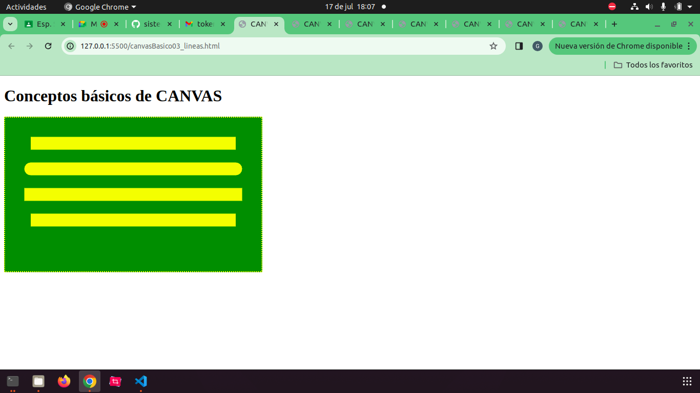
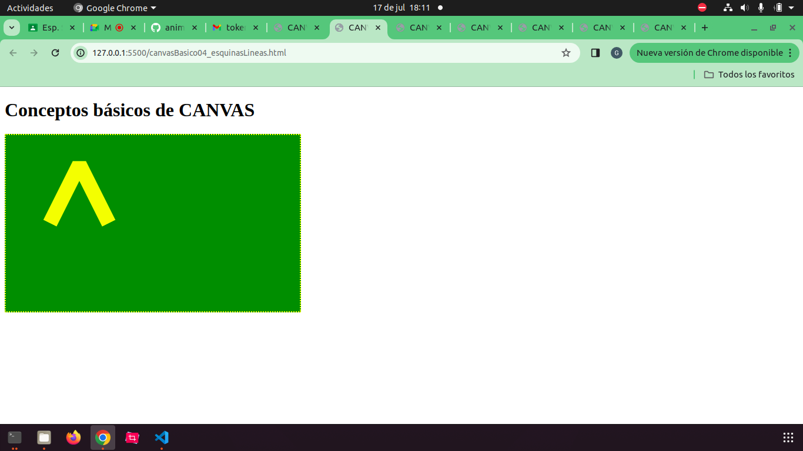
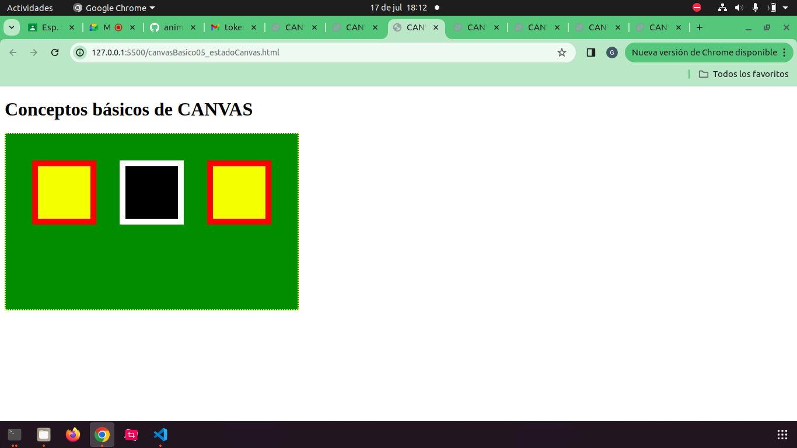
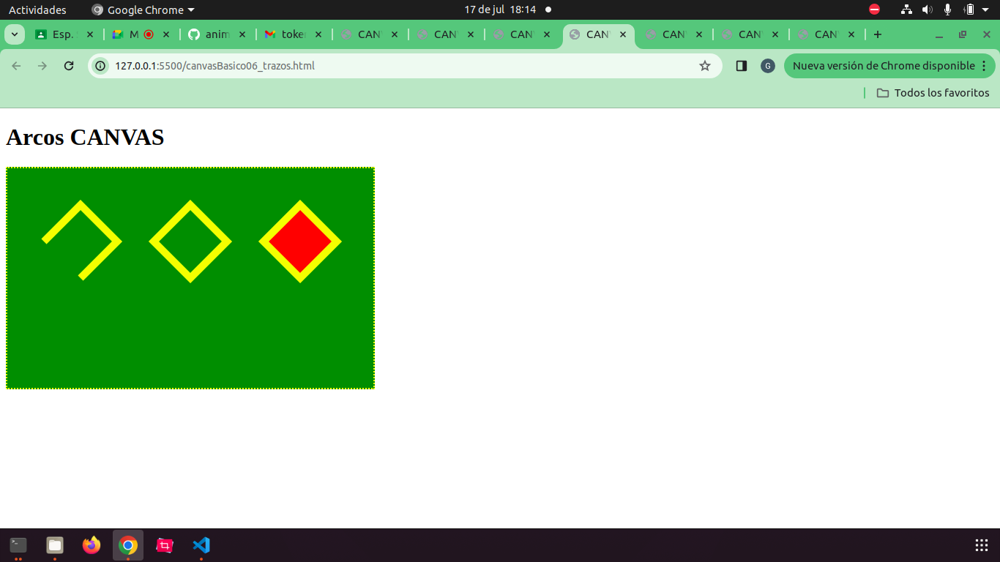
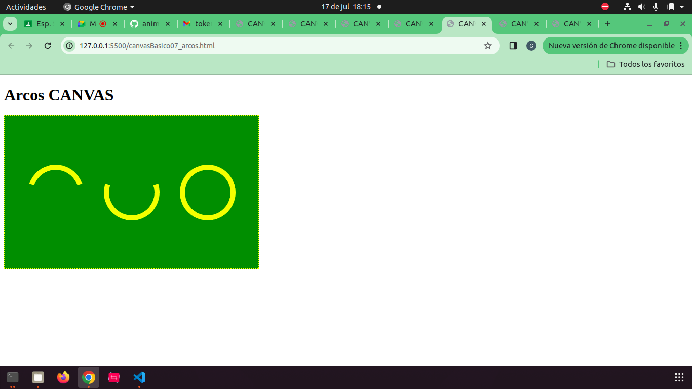
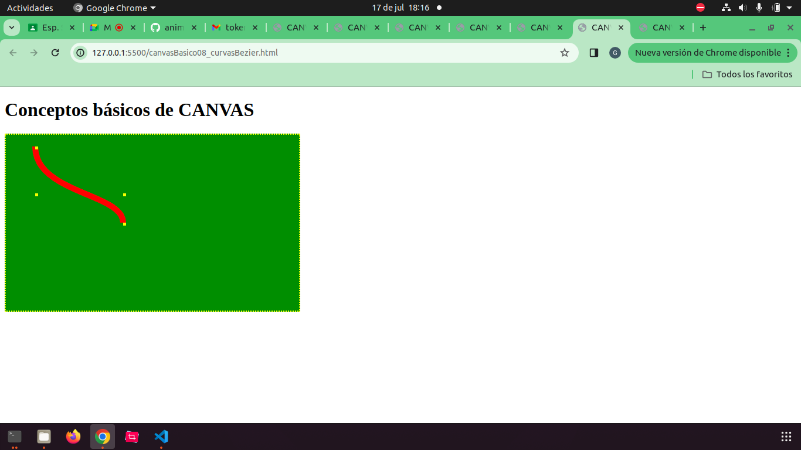
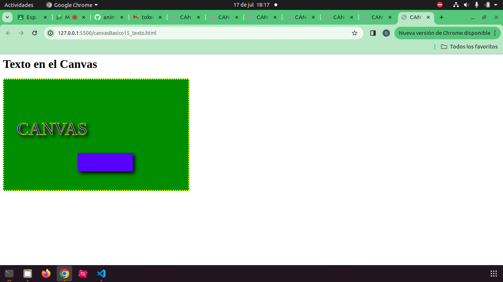

# Juegos con HTML5

## Elemento Canvas

- El elemento Canvas, junto al lenguaje JS nos permite crear animaciones y juegos 2d en el navegador.

- En el navegador el código se interpreta de manera secuencial

- Para utilizar el código JS, debemos esperar a que todos los elementos HTML hayan sido creados antes de ser utilizados.

- Alternativas:
    - Colocar el script en la parte inferior de la página.
    - Utilizar un detector de eventos que nos indique cuando los elementos han sido creados. (evento onload desde el body o script)

- Se crea una variable canvas por medio del identificador de la etiqueta
- Se verifica si la variable se creó correctamente
- En realidad se trabaja con el **contexto** de canvas 2d. Se crea una variable **ctx** con la cual se manipula el canvas.
- Se verifica que el contexto se haya creado de manera exitosa, dando la bienvenida por medio de un alert(), o advirtiendo un error de creación de contexto.

